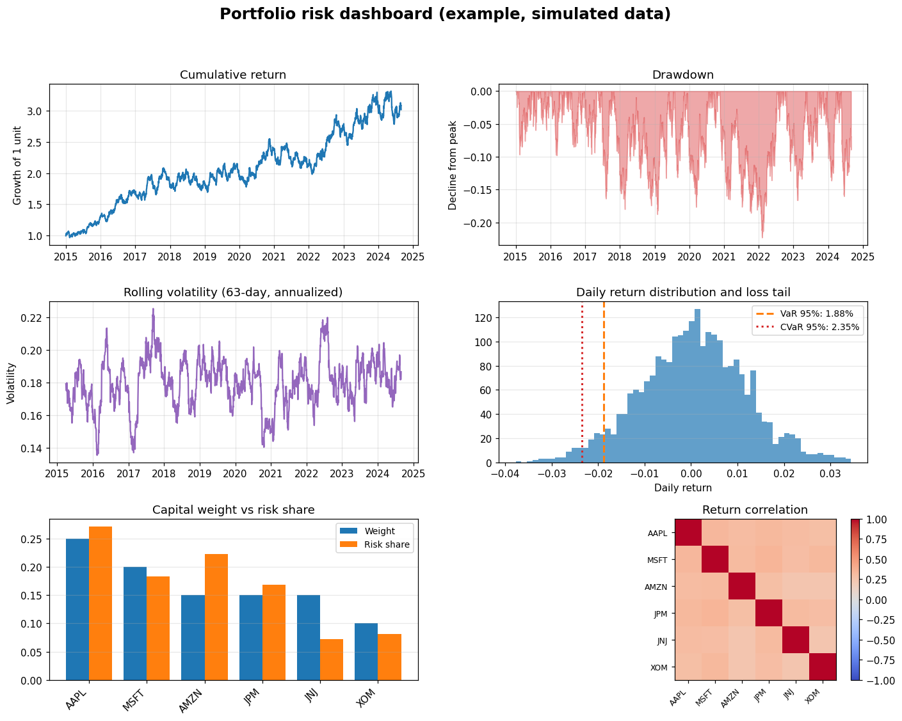

# Portfolio Risk Dashboard

A one-look risk view for a portfolio. Point it at a set of holdings and it
builds a six-panel dashboard plus a self-contained HTML report that answers the
questions a risk manager actually asks: how has it grown, how badly has it
fallen, how jumpy is it right now, what does a bad day look like, where does the
risk really sit, and how correlated are the pieces.

The thread running through all of it is one idea: a portfolio is a bundle of
risk exposures, not a list of positions. The dashboard is built to make that
idea visible.

## Example output

The dashboard below comes straight from the code in this repo. The committed
version was generated on simulated data, so it shows what the output looks like.
Run `python scripts/build_dashboard.py` to reproduce it on live market data.



The same run also writes a standalone HTML report (the dashboard image plus a
metrics table, all in one file that opens in any browser). A committed example
is at [images/example_dashboard.html](images/example_dashboard.html).

## What each panel tells you

- **Cumulative return.** The plain growth-of-one-unit line. Context for
  everything else.
- **Drawdown.** How far below its previous peak the portfolio has been, over
  time. This is the pain chart, and it usually matters more than the return.
- **Rolling volatility.** Annualized volatility over a moving window, so you can
  see when risk was building rather than just the single full-period number.
- **Return distribution and loss tail.** A histogram of daily returns with the
  value at risk and conditional value at risk marked. This is where the size of
  a bad day becomes concrete.
- **Capital weight vs risk share.** Side-by-side bars showing each holding's
  share of the money against its share of the risk. When these two do not match,
  and they rarely do, that gap is the whole point.
- **Return correlation.** How the holdings move together. Diversification only
  helps to the extent these are low.

## The risk measures

| Measure              | What it means                                                        |
|----------------------|----------------------------------------------------------------------|
| Historical VaR       | The loss the worst (1 - confidence) share of days exceeds, from the actual return history |
| Historical CVaR      | The average loss on those worst days (also called expected shortfall) |
| Parametric VaR       | The same idea under a normal-distribution assumption, for comparison |
| Annualized volatility| Standard deviation of returns, scaled to a year                      |
| Max drawdown         | The worst peak-to-trough decline                                     |
| Risk contribution    | Each holding's slice of total portfolio volatility                   |

Showing historical and parametric VaR side by side is deliberate. When the
parametric figure is smaller than the historical one, it is telling you the
returns have fatter tails than a normal distribution, so the tidy formula is
understating the real risk.

## How it works

| Module         | Responsibility                                                |
|----------------|---------------------------------------------------------------|
| `data.py`      | Load several tickers' adjusted close behind a swappable loader |
| `portfolio.py` | Normalize weights and build the portfolio return series       |
| `risk.py`      | VaR, CVaR, rolling volatility, drawdown, risk contributions   |
| `dashboard.py` | Compose the six-panel figure                                  |
| `report.py`    | Render the standalone HTML report                             |

The parametric VaR uses Python's standard-library `statistics.NormalDist`, so
there is no SciPy dependency.

## Getting started

```bash
git clone https://github.com/KelsonLam/portfolio-risk-dashboard.git
cd portfolio-risk-dashboard
pip install -r requirements.txt
python scripts/build_dashboard.py
```

Edit `config.yaml` to set your own holdings, weights, confidence level, and
rolling window. The run prints the metrics and writes both the dashboard image
and the HTML report to `results/`.

## Being honest about the assumptions

- **VaR is backward-looking.** Both the historical and parametric figures are
  built from past returns. They describe risk that already showed up, not risk
  that has not appeared yet, and tail risk is exactly the kind that hides.
- **Constant weights.** The portfolio rebalances to fixed weights daily. Real
  books drift and rebalance on a schedule, which changes both returns and risk.
- **Correlations are not stable.** The correlation panel is a full-period
  average. In a crisis, correlations tend to jump toward one, which is when
  diversification helps least. A single heatmap cannot show that.
- **One-day VaR.** The VaR and CVaR figures are one-day. Scaling them to longer
  horizons is not as simple as multiplying by the square root of time once
  returns are not independent.

## Tests

```bash
pip install pytest
pytest
```

The suite runs on synthetic returns. It checks weight normalization, that
historical VaR matches the empirical percentile, that CVaR is at least as large
as VaR, the parametric VaR formula, and that the risk contributions decompose
portfolio volatility exactly.

## Project layout

```
portfolio-risk-dashboard/
├── config.yaml
├── requirements.txt
├── scripts/
│   └── build_dashboard.py
├── src/risk_dashboard/
│   ├── data.py
│   ├── portfolio.py
│   ├── risk.py
│   ├── dashboard.py
│   └── report.py
└── tests/
    └── test_risk.py
```

## License

MIT. See [LICENSE](LICENSE).
